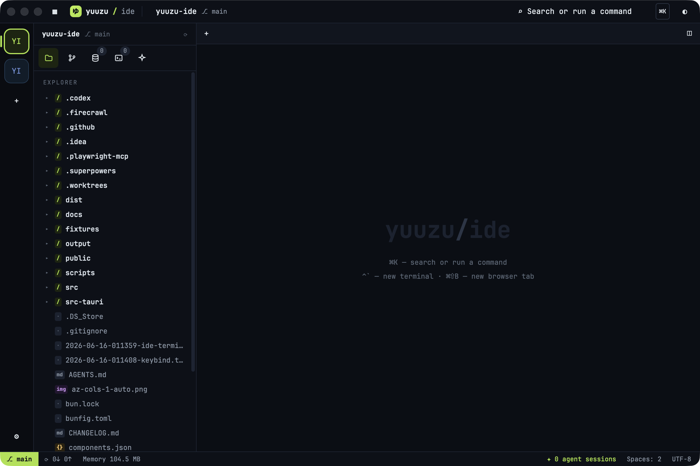
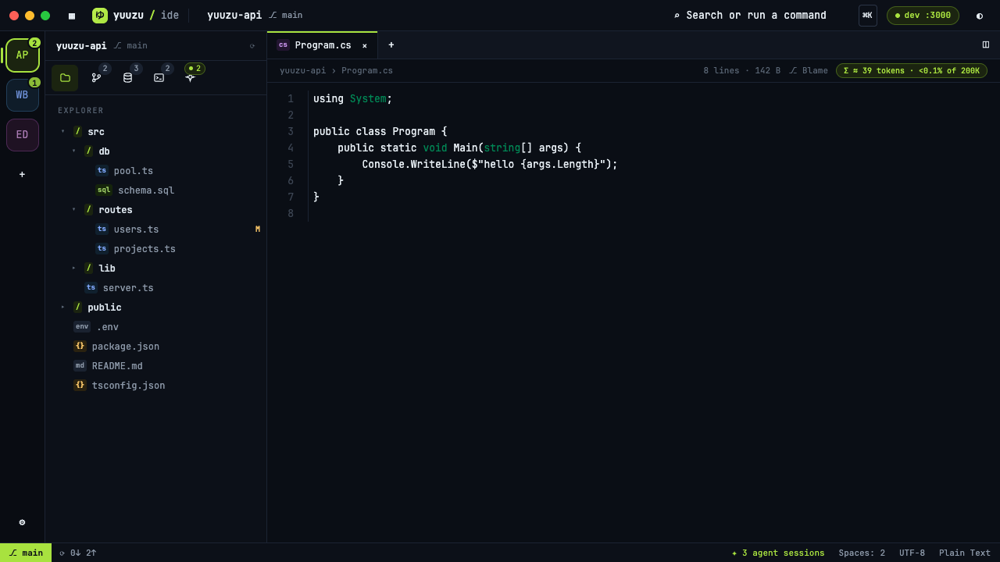
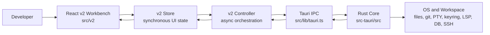

# Yuuzu-IDE

[](https://github.com/NakiriYuuzu/Yuuzu-IDE/actions/workflows/ci.yml)
[](https://github.com/NakiriYuuzu/Yuuzu-IDE/actions/workflows/release.yml)


Yuuzu-IDE is a Rust-first native desktop IDE for multi-project daily
development. It is built with Tauri 2, React, TypeScript, CodeMirror, xterm.js,
and a Rust/Tauri core that owns filesystem access, search, git, terminals, LSP,
database access, remote access, recovery, diagnostics, and other
security-sensitive workflows.

The project goal is a smaller, faster, keyboard-friendly workbench that can keep
multiple active projects available without paying the memory cost of several
heavy IDE windows.



## Search Keywords

Tauri IDE, Rust desktop IDE, React TypeScript IDE, lightweight JetBrains
alternative, multi-workspace IDE, CodeMirror desktop editor, xterm terminal IDE,
Git workbench, database IDE, SSH SFTP desktop client, local-first developer
tools, AI coding workbench, agent workspace, native IDE for macOS and Windows.

## Table Of Contents

- [Why Yuuzu-IDE](#why-yuuzu-ide)
- [Current Status](#current-status)
- [Feature Highlights](#feature-highlights)
- [Implementation Matrix](#implementation-matrix)
- [Architecture](#architecture)
- [Repository Layout](#repository-layout)
- [Getting Started](#getting-started)
- [Development Commands](#development-commands)
- [Verification](#verification)
- [Release And Updates](#release-and-updates)
- [Documentation Map](#documentation-map)
- [Security Model](#security-model)
- [Roadmap](#roadmap)
- [Contributing](#contributing)
- [License](#license)

## Why Yuuzu-IDE

Most daily development sessions span more than one repository: the app, the API,
the package under test, an automation repo, and a scratch workspace. Opening a
full IDE for each one is convenient but expensive. Yuuzu-IDE takes a different
route:

- one native desktop window for many workspaces
- Rust-owned project, filesystem, terminal, git, LSP, database, and remote
  operations
- React for the visible workbench, not for unbounded backend state
- CodeMirror for the editor interaction surface, with LSP still owned by the
  Rust/Tauri side
- xterm.js for terminal rendering, backed by Rust PTY process lifecycle
- first-class panels for Git, Database, SSH/SFTP, Browser Preview, AgentZone,
  recovery, diagnostics, and settings
- conservative safety boundaries for destructive git, filesystem, database, and
  remote operations

Yuuzu-IDE is not trying to be a public extension marketplace or a cloud IDE. It
is a local-first, personal daily-driver IDE shaped around fast project switching,
high-signal developer surfaces, and explicit verification loops.

## Current Status

Yuuzu-IDE is currently a personal alpha at version `0.1.0`.

The shipping frontend is the v2 "Yuzu" shell in [`src/v2`](src/v2). The legacy
`src/app` shell has been removed from the active app path. Some older feature UI
components remain under [`src/features`](src/features) as models, API wrappers,
tests, or support components, but the rendered workbench is v2.

The important status split:

- Core architecture, native shell, workspace, file, terminal, git, agent,
  browser preview, database, remote, settings, recovery, diagnostics, updater,
  and packaging work have milestone evidence in the repository.
- The v2 shell fully exposes the shell, editor/search, terminal, git, agent,
  browser preview, database, remote, settings, recovery, diagnostics, and
  updater surfaces.
- Language support is partially wired in v2: editor diagnostics are present,
  while the full LSP control/log UI is still being completed.
- Docs, Debug, and Extension UI are proven in earlier implementation work but
  still need v2 port-over work.
- CodeMirror 6 is the default editor surface, the first-party C# Lezer syntax
  package exists, and packaged-app latency/memory parity measurements are still
  pending.

See [`roadmap.md`](roadmap.md) for the detailed product plan.

## Feature Highlights

### Native Multi-Workspace Workbench

- Tauri 2 desktop shell with one primary WebView workbench
- project rail for switching between registered workspaces
- persisted workspace registry and per-workspace state
- command search entry point from the title bar
- status bar with branch, sync, memory, agent session, spacing, encoding, and
  language context
- dark/light theme support and Yuzu visual system in [`src/v2/yuzu.css`](src/v2/yuzu.css)

### Files, Search, And Editor

- Rust-owned file scanning, file reads/writes, create/rename/delete, path
  containment, file watcher events, and large-file guardrails
- Explorer tree with lazy directory loading
- filename and full-text search paths through the Rust core
- dirty state, save/reload flows, external change awareness, and unsaved backup
  recovery
- CodeMirror 6 default editor surface
- explicit textarea fallback for editor-engine compatibility
- syntax support for Rust, C#, YAML, Markdown, HTML, CSS, XML, JSON,
  JavaScript, and TypeScript
- first-party Lezer-based C# syntax package under
  [`src/features/editor-codemirror/lang-csharp`](src/features/editor-codemirror/lang-csharp)
- large-file CodeMirror verification through
  [`scripts/verify-codemirror-large-file.mjs`](scripts/verify-codemirror-large-file.mjs)



### Terminal And Tasks

- integrated terminal tabs backed by Rust PTY sessions
- xterm.js rendering through
  [`src/features/terminal/TerminalTab.tsx`](src/features/terminal/TerminalTab.tsx)
- terminal output replay buffer and lifecycle tests
- named terminal behavior and OSC title handling
- terminal sessions can appear in the main content area and AgentZone

### Git Workbench

- source control panel with staged/unstaged/conflict groups
- commit, fetch, branch popup, stash panel, and destructive confirmation flows
- structured diff hunks and word-level diff ranges
- hunk and line staging/unstaging
- conflict resolver and mark-resolved flow
- real DAG commit graph, filters, pagination, commit detail, file history, and
  blame support
- commit actions including checkout, branch from commit, cherry-pick, revert,
  reset, copy hash, and export
- Rust command tests and frontend model/view tests around safety-sensitive flows

### Database Tools

- SQLite, PostgreSQL, and Microsoft SQL Server profile support
- schema explorer, table data view, SQL console, query history, and CSV export
- read-only defaults and production-profile safety model
- visible confirmations for mutating and destructive SQL
- keyring-backed secret storage; profile metadata does not persist passwords

### SSH/SFTP And Remote Work

- SSH host profiles
- SFTP local/remote panes
- remote directory listing, upload, download, and command execution surfaces
- remote connection health and disconnect paths
- Rust-side remote implementation using `russh` and `russh-sftp`

### Browser Preview

- local browser preview tab for development servers
- URL validation for loopback/local targets
- reload and screenshot capture paths for verification workflows
- browser preview model and UI tests retained as regression coverage

### AgentZone

- workspace-scoped agent surface for local agent sessions
- multiple agent windows with status, terminal-backed output, and session count
  in the status bar
- designed around plan, edit, verify, review, and report workflows
- context-oriented product direction for docs, diffs, terminal output, and
  diagnostics

### Recovery, Diagnostics, Settings, And Updates

- Rust-native unsaved edit backups with save/list/restore/discard behavior
- Settings modal with recovery, performance/diagnostics, keybindings, updates,
  and personal setup categories
- diagnostic JSONL persistence and bounded readback
- app metrics for process id, memory, uptime, workspace count, docs index
  entries, and file tree entries
- VS Code keybinding JSON import path
- GitHub Releases based updater through `tauri-plugin-updater`

## Implementation Matrix

| Area | v2 user-reachable status | Notes |
| --- | --- | --- |
| App shell and multi-workspace core | Available | Project rail, title bar, command search, status bar, settings, persisted registry. |
| Explorer, files, search, editor | Available | Rust-owned filesystem/search/watcher; CodeMirror default editor; textarea fallback. |
| Terminal and task surface | Available | xterm.js renderer with Rust PTY lifecycle. |
| Git workflows | Available | Source control, DAG graph, diffs, stash, branch, blame, conflict, export. |
| Agent workflows | Available | AgentZone is part of the v2 shell. |
| Browser preview | Available | Local preview, reload, screenshot capture paths. |
| Database tools | Available | SQLite, PostgreSQL, MS SQL Server, keyring-backed secrets, confirmations. |
| SSH/SFTP remote tools | Available | Host profiles, SFTP panes, remote command path. |
| Settings, recovery, diagnostics, updater | Available | Daily-driver hardening surface is implemented. |
| Language intelligence | Partial | Editor diagnostics are wired; full LSP control/log panel remains active v2 completion work. |
| Docs context UI | Pending v2 port | Backend evidence exists; v2 shell port is active roadmap work. |
| Debug UI | Pending v2 port | Backend/old-shell evidence exists; breakpoint/debug panel v2 work remains. |
| Extension UI | Pending v2 port | Extension model exists; no public extension marketplace yet. |
| CodeMirror parity | In progress | Default editor and C# package exist; packaged-app latency/memory parity remains. |

## Architecture

Yuuzu-IDE is intentionally Rust-first. React renders the workbench and owns
transient interaction state; Rust owns the expensive, durable, and
security-sensitive parts of the IDE.



### Ownership Boundaries

Rust/Tauri owns:

- workspace registry and trusted roots
- filesystem reads/writes, scanning, watching, and path containment
- search, git, PTY, task, LSP, database, remote, diagnostics, recovery, and
  updater command surfaces
- secret storage and credentials
- blocking process/filesystem work off the UI path
- safety checks for destructive operations

React/v2 owns:

- visible workbench layout
- project rail, side panel, tabs, split panes, modals, toasts, overlays, and
  editor host composition
- deterministic synchronous UI state in [`src/v2/v2-store.ts`](src/v2/v2-store.ts)
- mapping from core payloads into renderable v2 model objects through
  [`src/v2/bridge.ts`](src/v2/bridge.ts)

Async orchestration sits in [`src/v2/controller.ts`](src/v2/controller.ts).
The IPC boundary is registered in [`src-tauri/src/commands.rs`](src-tauri/src/commands.rs)
and [`src-tauri/src/lib.rs`](src-tauri/src/lib.rs).

## Repository Layout

```text
.
+-- src/
|   +-- App.tsx                         # Mounts the v2 workbench shell
|   +-- main.tsx                        # React entry point
|   +-- lib/tauri.ts                    # Tauri invoke wrapper
|   +-- v2/                             # Shipping Yuzu workbench
|   |   +-- Workbench.tsx               # Visible shell root
|   |   +-- v2-store.ts                 # Deterministic UI store
|   |   +-- controller.ts               # Real backend delegate/orchestration
|   |   +-- bridge.ts                   # Payload mapping helpers
|   |   +-- editor/                     # CodeMirror and textarea editor surfaces
|   |   +-- yuzu.css                    # Active visual system
|   +-- features/                       # Models, APIs, tests, support components
|       +-- editor-codemirror/          # CodeMirror language selection and C# package
|       +-- terminal/TerminalTab.tsx    # Reused xterm terminal renderer
|       +-- git/                        # Git models and support views
|       +-- database/                   # Database APIs and models
|       +-- language/                   # LSP APIs and models
|       +-- ...
+-- src-tauri/
|   +-- tauri.conf.json                 # Tauri app, bundle, updater config
|   +-- Cargo.toml                      # Rust crate manifest
|   +-- src/
|       +-- commands.rs                 # IPC command boundary
|       +-- file_system.rs              # Bounded file operations
|       +-- search.rs                   # Workspace search
|       +-- git.rs / git_log.rs         # Source-control workflows
|       +-- terminal.rs / pty.rs        # Terminal process lifecycle
|       +-- lsp.rs                      # Language-server lifecycle
|       +-- database.rs                 # DB profiles, query execution, secrets
|       +-- remote.rs                   # SSH/SFTP
|       +-- recovery.rs                 # Unsaved backup store
|       +-- diagnostics.rs / metrics.rs # Logs and runtime metrics
|       +-- ...
+-- docs/
|   +-- architecture/                   # Milestone evidence and stack notes
|   +-- release/                        # Release and update strategy
|   +-- setup/                          # Local daily-driver setup
|   +-- superpowers/                    # Specs and implementation plans
|   +-- ui-design/                      # Source of truth for v2 visual work
|   +-- assets/                         # README and docs images
+-- scripts/
|   +-- verify-codemirror-large-file.mjs
|   +-- extract-release-notes.mjs
+-- package.json
+-- bun.lock
+-- vite.config.ts
+-- roadmap.md
+-- AGENTS.md
```

## Getting Started

### Prerequisites

- macOS or Windows development machine supported by Tauri 2
- Bun
- Rust stable toolchain with Cargo
- platform prerequisites for Tauri desktop builds
- Git

This repository uses Bun for JavaScript and TypeScript workflows. Prefer
`bun`, `bunx`, and `bun run` over `npm`, `npx`, or `npm run`.

### Clone And Install

```bash
git clone https://github.com/NakiriYuuzu/Yuuzu-IDE.git
cd Yuuzu-IDE
bun install
```

### Run The Native App In Development

```bash
bun run tauri dev
```

Tauri is configured to run the Vite dev server on `http://localhost:1420`.

### Run The Browser-Only Frontend Preview

```bash
bun run dev
```

Use this only for UI iteration. Browser preview does not provide the full Tauri
backend environment.

### Build Frontend Assets

```bash
bun run build
```

### Build A Debug Desktop Bundle

```bash
bun run tauri build --debug
```

On macOS this produces a debug app and DMG under `src-tauri/target/debug/bundle`.

## Development Commands

| Task | Command |
| --- | --- |
| Install dependencies | `bun install` |
| Start Tauri dev app | `bun run tauri dev` |
| Start Vite-only preview | `bun run dev` |
| Build frontend | `bun run build` |
| Run frontend tests | `bun test` |
| Run Rust tests | `. "$HOME/.cargo/env" && cargo test --manifest-path src-tauri/Cargo.toml` |
| Check Rust formatting | `. "$HOME/.cargo/env" && cargo fmt --manifest-path src-tauri/Cargo.toml --check` |
| Run Rust clippy | `. "$HOME/.cargo/env" && cargo clippy --manifest-path src-tauri/Cargo.toml --all-targets --all-features -- -D warnings` |
| Verify CodeMirror large-file behavior | `bun run verify:editor-large-file` |
| Generate C# parser | `bun run gen:csharp-parser` |
| Build debug desktop app | `bun run tauri build --debug` |

## Verification

For narrow changes, run the smallest focused test first, then broaden based on
risk. Before replacing a local app bundle or claiming a broad behavior is
ready, use the full gate:

```bash
bun test
bun run build
. "$HOME/.cargo/env" && cargo test --manifest-path src-tauri/Cargo.toml
. "$HOME/.cargo/env" && cargo fmt --manifest-path src-tauri/Cargo.toml --check
. "$HOME/.cargo/env" && cargo clippy --manifest-path src-tauri/Cargo.toml --all-targets --all-features -- -D warnings
bun run tauri build --debug
```

For editor platform work, also run:

```bash
bun run verify:editor-large-file
```

The project has focused coverage across Bun tests, Rust inline tests, targeted
browser/CDP checks, and Tauri debug build verification. The current CI workflow
runs Bun tests, frontend build, Rust tests, Rust format, and Rust clippy on
pull requests and pushes to `main`.

## Release And Updates

Yuuzu-IDE uses GitHub Actions and `tauri-plugin-updater` for release builds and
in-app updates.

Release targets:

- macOS Apple Silicon
- Windows x64
- Windows portable zip as a release asset

The release workflow lives in [`.github/workflows/release.yml`](.github/workflows/release.yml).
It builds draft GitHub Releases for tags matching `v*.*.*` or manual workflow
dispatch. Release notes are extracted from [`CHANGELOG.md`](CHANGELOG.md) by
[`scripts/extract-release-notes.mjs`](scripts/extract-release-notes.mjs).

Updater configuration is in [`src-tauri/tauri.conf.json`](src-tauri/tauri.conf.json).
The app checks:

```text
https://github.com/NakiriYuuzu/Yuuzu-IDE/releases/latest/download/latest.json
```

Read [`docs/release/update-strategy.md`](docs/release/update-strategy.md) before
publishing a release. The release process requires version synchronization
across:

- [`package.json`](package.json)
- [`src-tauri/Cargo.toml`](src-tauri/Cargo.toml)
- [`src-tauri/tauri.conf.json`](src-tauri/tauri.conf.json)

## Documentation Map

Start here:

- [`roadmap.md`](roadmap.md) - product direction, roadmap status, current priority
- [`AGENTS.md`](AGENTS.md) - repository rules for coding agents
- [`docs/architecture/progress.md`](docs/architecture/progress.md) - historical milestone progress
- [`docs/architecture/tech-stack.md`](docs/architecture/tech-stack.md) - stack decision and ownership model
- [`docs/setup/personal-setup.md`](docs/setup/personal-setup.md) - local daily-driver setup
- [`docs/release/update-strategy.md`](docs/release/update-strategy.md) - release and updater process
- [`docs/architecture/git-deep-dive-results.md`](docs/architecture/git-deep-dive-results.md) - advanced Git workflow evidence

For v2 UI work, treat [`docs/ui-design`](docs/ui-design) as the design source of
truth.

## Security Model

Yuuzu-IDE is a local desktop developer tool, but it still treats workspace data
and project commands as sensitive.

Key rules:

- workspace roots must remain bounded and trusted before filesystem, git,
  database, remote, or process operations
- Rust/Tauri owns security-sensitive operations instead of pushing them into
  frontend state
- database passwords and credentials belong in OS keyring-backed stores
- profile metadata should not persist secrets in plain JSON
- mutating or destructive SQL requires visible confirmation
- destructive git flows use typed confirmations where appropriate
- terminal, task, remote, and agent outputs should avoid leaking secrets into
  durable logs or shared context
- public release updates are verified through Tauri updater signing metadata

If you are adding a command that accepts `workspaceRoot`, inspect the existing
boundary checks in `src-tauri/src` and add focused Rust tests around path
containment and unsafe inputs.

## Roadmap

Active priorities are documented in [`roadmap.md`](roadmap.md).

Current high-level focus:

- finish porting Docs, Debug, and Extension UI into the v2 shell
- connect the v2 Language panel to real LSP state and logs
- close remaining editor performance measurement work
- continue CodeMirror parity work, including packaged-app latency and memory
  measurements
- preserve the Rust-owned model for document state, file watching, auto-save,
  LSP, indexing, diagnostics, and scheduling

Non-goals for the current phase:

- public extension marketplace
- team collaboration features
- replacing language servers with homemade semantic analyzers
- removing the textarea fallback before CodeMirror reaches verified parity
- weakening destructive-action confirmations for speed

## Contributing

Yuuzu-IDE is currently a personal alpha project. Contributions and local changes
should favor correctness, small scope, and evidence over broad rewrites.

Before making non-trivial changes:

- read [`AGENTS.md`](AGENTS.md)
- check `git status --short`
- use [`roadmap.md`](roadmap.md) and the relevant `docs/architecture` result
  file as context
- keep changes surgical
- add or update focused tests for behavior changes
- run the verification gate that matches the blast radius
- do not mark roadmap work complete without cross-checking code, tests, docs,
  and current v2 reachability

Recommended change style:

- backend domain behavior in focused Rust modules under `src-tauri/src`
- async frontend orchestration in `src/v2/controller.ts`
- pure payload mapping in `src/v2/bridge.ts`
- deterministic UI state in `src/v2/v2-store.ts`
- visible v2 styling in `src/v2/yuzu.css`
- tests close to the behavior being changed

## Troubleshooting

### Vite Reports Large Chunk Warnings

Large editor and workbench chunks are expected in some builds while CodeMirror
and editor-platform work is still in progress. Treat warnings as a bundle-size
signal, not as a failed build, unless `bun run build` exits non-zero.

### Tauri Build Fails Before Rust Commands Run

Confirm that the Rust toolchain is loaded:

```bash
. "$HOME/.cargo/env"
rustc --version
cargo --version
```

Then rerun the command through the Tauri manifest:

```bash
cargo test --manifest-path src-tauri/Cargo.toml
```

### macOS Blocks A Downloaded Build

Current local/debug builds do not provide full public notarization. See
[`docs/release/update-strategy.md`](docs/release/update-strategy.md) for the
current release constraints and manual open notes.

### Database Connections Fail In Local Development

Check that the profile metadata is correct and that the OS keyring is available.
Secrets should be resolved through the backend; do not add passwords to frontend
state or committed JSON.

### The Language Panel Looks Incomplete

Editor diagnostics and the LSP backend exist, but the full v2 language-server
control/log surface is still an active roadmap item.

## License

No public license file is currently published in this repository. Until a
license is added, treat the code and assets as all rights reserved by the
project owner.
