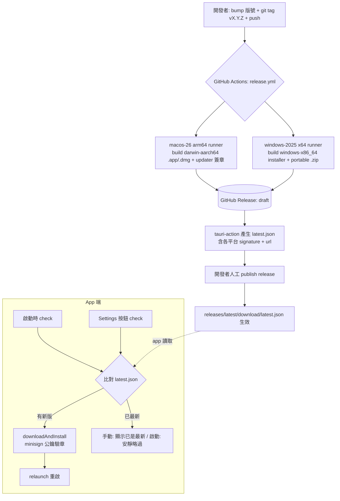

# CI/CD Release Pipeline 與 Auto-Update 設計

> 🟡 **實作狀態:部分實作**（2026-06-22 核對）— CI/CD workflow、updater/process plugin、Settings › Updates UI、啟動 silent check、updater artifacts、macOS ad-hoc signing、Windows portable `.zip` release asset 與文件已落地並通過本地驗證。尚未完成：owner 產生 minisign 金鑰、設定 GitHub Secrets、把 `plugins.updater.pubkey` / endpoint 寫入 `tauri.conf.json`、以及 GitHub release 乾跑與端到端更新驗證。對應 plan：`docs/superpowers/plans/2026-06-15-cicd-autoupdate.md`

- **日期**：2026-06-15
- **狀態**：部分實作，待簽章金鑰與 release 端到端驗證
- **對象**：Yuuzu-IDE（Tauri 2 desktop app，repo `github.com/NakiriYuuzu/Yuuzu-IDE`）
- **取代**：`docs/release/update-strategy.md` 目前的手動換 bundle 流程

## 1. 目標與範圍

把目前「本地手動 build + 換 bundle」的發版方式，升級成：

1. **GitHub CI/CD**：push 一個版本 tag 後，自動在 macOS 與 Windows 上 build release artifacts，簽章後上傳到 GitHub Release。
2. **App 內 Auto-Update**：app 能查詢 GitHub Releases、下載並安裝新版、重啟自己。啟動時靜默檢查，Settings 另提供手動「Check for updates」。

範圍**僅限個人自用**規模——不做 OS code signing、不做更新伺服器、不做 beta/stable 分流。

## 2. 決策紀錄（已鎖定）

| 項目 | 決定 | 理由 |
|------|------|------|
| 更新架構 | 方案 A：`tauri-plugin-updater` + GitHub Releases + `tauri-action` | 官方、免費、零伺服器，貼合現有 GitHub 流程 |
| 目標平台 | macOS Apple Silicon (`darwin-aarch64`) + Windows x64 (`windows-x86_64`) | 對齊目前自用平台，不做 Intel macOS / Windows ARM / Linux |
| macOS 架構 | 只 build Apple Silicon arm64（不做 Universal） | 自用 Apple Silicon，build 更快、體積更小 |
| Windows artifact | x64 NSIS/MSI installer artifacts + portable `.zip` release asset；`latest.json` 指向 Tauri updater 支援的 signed installer artifact | Windows `.zip` 是免安裝 portable 版本；不要把 portable zip 當成 updater URL |
| OS code signing | 不做 Developer ID / notarization；macOS 用 ad-hoc signing identity `"-"`；updater 仍用 minisign 簽章 | 免費；ad-hoc signing 可降低 Apple Silicon 從 GitHub Releases 下載後被判定 damaged 的風險 |
| 更新 UX | 啟動靜默檢查 + Settings 手動按鈕 | 非阻斷、自用可控 |
| Release 發布 | CI 建 **draft**，人工審核後手動 publish | 發版前最後把關 |
| CI 驗證 | 加 `ci.yml`，在 push/PR 跑既有驗證序列 | 沿用 update-strategy.md 的品質閘 |

## 3. 架構總覽



**信任鏈**：CI 用 minisign **私鑰**簽章 → `latest.json` 帶 signature → app 內建 minisign **公鑰**驗證 → 驗章失敗就拒絕安裝。這條鏈不依賴 OS code signing，是更新完整性的根本保證。

## 4. 元件設計

### 4.1 Release pipeline — `.github/workflows/release.yml`

- **觸發**：`push` tag 符合 `v*.*.*`；另加 `workflow_dispatch`，但只用於重跑指定 release tag，避免手動觸發時 `github.ref_name` 變成 branch 名。
- **權限**：`permissions: contents: write`（建立 release 用）。
- **Matrix**：明確列兩個發版目標：`macos-26` → `darwin-aarch64`、`windows-2025` → `windows-x86_64`。兩者各自原生 build，**不做跨平台交叉編譯**（因 `keyring` / `russh` / `tiberius` 等 native deps 交叉編譯成本高）。macOS 明確傳 `--target aarch64-apple-darwin`；Windows 明確傳 `--target x86_64-pc-windows-msvc`，讓 artifact 與 updater platform key 穩定。
- **步驟骨架**：

```yaml
name: release
on:
  push:
    tags: ['v*.*.*']
  workflow_dispatch:
    inputs:
      ref:
        description: 'Release tag to build, e.g. v0.2.0'
        required: true
        type: string

jobs:
  build:
    permissions:
      contents: write
    strategy:
      fail-fast: false
      matrix:
        include:
          - os: macos-26
            rustTarget: aarch64-apple-darwin
            args: --target aarch64-apple-darwin
          - os: windows-2025
            rustTarget: x86_64-pc-windows-msvc
            args: --target x86_64-pc-windows-msvc
    runs-on: ${{ matrix.os }}
    steps:
      - uses: actions/checkout@v4
        with:
          ref: ${{ github.event_name == 'workflow_dispatch' && inputs.ref || github.ref }}
      - uses: oven-sh/setup-bun@v2
      - uses: dtolnay/rust-toolchain@stable
        with:
          targets: ${{ matrix.rustTarget }}
      - uses: swatinem/rust-cache@v2
        with:
          workspaces: src-tauri
      - run: bun install
      - uses: tauri-apps/tauri-action@v0
        env:
          GITHUB_TOKEN: ${{ secrets.GITHUB_TOKEN }}
          TAURI_SIGNING_PRIVATE_KEY: ${{ secrets.TAURI_SIGNING_PRIVATE_KEY }}
          TAURI_SIGNING_PRIVATE_KEY_PASSWORD: ${{ secrets.TAURI_SIGNING_PRIVATE_KEY_PASSWORD }}
        with:
          tagName: ${{ github.event_name == 'workflow_dispatch' && inputs.ref || github.ref_name }}
          releaseName: 'Yuuzu-IDE ${{ github.event_name == 'workflow_dispatch' && inputs.ref || github.ref_name }}'
          releaseDraft: true
          prerelease: false
          args: ${{ matrix.args }}
```

- `tauri-action` 自動：build → 用簽章金鑰產生 updater artifacts（macOS `.app.tar.gz`、Windows NSIS/MSI installer artifact、各自 `.sig`）→ 上傳到 release → 產生並上傳 `latest.json`。
- Windows portable `.zip` 是額外 release asset，由 workflow 在 `tauri-action` 後把 release binary 打包上傳；它不進 `latest.json`。
- `releaseDraft: true`：兩個 runner 會 upload 到同一個 draft release；都跑完後人工 publish。

### 4.2 CI 驗證 — `.github/workflows/ci.yml`

- **觸發**：`push` 到 `main`、以及對 `main` 的 `pull_request`。
- **Runner**：單一 `macos-26`（macOS arm64，內建 WebKit，免裝 Linux 的 webkit2gtk apt 相依，最省事）。
- **步驟**：沿用 `docs/release/update-strategy.md` 既有序列：

```yaml
- run: bun install
- run: bun test
- run: bun run build
- run: cargo test --manifest-path src-tauri/Cargo.toml
- run: cargo fmt --manifest-path src-tauri/Cargo.toml --check
- run: cargo clippy --manifest-path src-tauri/Cargo.toml --all-targets --all-features -- -D warnings
```

- 可選優化（暫不做）：把 frontend（`bun test`/`bun run build`）拆到 `ubuntu-latest` 省成本，rust 檢查留 `macos-26`。

### 4.3 Updater plugin 整合（app 端）

新增兩個官方 plugin：

- `tauri-plugin-updater` — 查詢 / 下載 / 安裝更新。
- `tauri-plugin-process` — 安裝後 `relaunch()` 重啟 app。

用 CLI 自動接線（會改 `Cargo.toml`、`lib.rs` 註冊、`package.json`、capability）：

```bash
bun run tauri add updater
bun run tauri add process
```

**`src-tauri/tauri.conf.json` 調整**：

```jsonc
{
  "bundle": {
    "active": true,
    "targets": "all",
    "createUpdaterArtifacts": true,  // 產生 Tauri updater 支援的簽章更新 artifacts
    "macOS": {
      "signingIdentity": "-"         // ad-hoc signing，非 Developer ID/notarization
    }
  },
  "plugins": {
    "updater": {
      "endpoints": [
        "https://github.com/NakiriYuuzu/Yuuzu-IDE/releases/latest/download/latest.json"
      ],
      "pubkey": "<minisign 公鑰，見 4.4>"
    }
  }
}
```

**`src-tauri/capabilities/default.json` 新增權限**：

```json
"updater:default",
"process:allow-restart"
```

### 4.4 Minisign 金鑰

```bash
bun run tauri signer generate -w ~/.tauri/yuuzu-ide.key
```

- **私鑰內容** → GitHub repo secret `TAURI_SIGNING_PRIVATE_KEY`
- **私鑰密碼** → GitHub repo secret `TAURI_SIGNING_PRIVATE_KEY_PASSWORD`
- **公鑰** → 填入 `tauri.conf.json` 的 `plugins.updater.pubkey`
- 私鑰檔**絕不進 git**；備份到密碼管理器（遺失 = 無法再發可被現有 app 接受的更新）。

### 4.5 前端 Updater 模組與 UX

新增 `src/v2/updater.ts`，封裝流程：

```ts
import { check } from '@tauri-apps/plugin-updater'
import { relaunch } from '@tauri-apps/plugin-process'

// 回傳是否有更新；silent=true 時，失敗/無更新都不彈訊息
export async function checkForUpdate(opts: { silent: boolean }): Promise<void>
```

行為：

1. `const update = await check()`
2. 有更新 → 顯示**非阻斷 toast/dialog**：「vX.Y.Z 可用 — Install & Restart」。
3. 使用者確認 → `update.downloadAndInstall(onProgress)`（顯示下載進度）→ `relaunch()`。
4. **啟動檢查**（silent）：在 v2 啟動流程呼叫 `checkForUpdate({ silent: true })`；無網路 / 無更新一律安靜略過。
5. **Settings 按鈕**（非 silent）：呼叫 `checkForUpdate({ silent: false })`；無更新時明確顯示「已是最新版本」、錯誤時顯示錯誤。

UI 接點（沿用 v2 既有元件，不新造 UI 框架）：

- **啟動 silent check**：在 v2 啟動處（`src/v2/Workbench.tsx` mount 或 store 初始化）觸發；有更新時用**既有的 `Toast` 元件**（`src/v2/Overlays.tsx`）顯示非阻斷通知 + 「Install & Restart」動作。
- **手動按鈕**：加進**既有的 `SettingsModal`**（`src/v2/Overlays.tsx`，section 定義在 `src/v2/v2-model.ts` 的 `SETTINGS_CONFIG`，由 `ProjectRail` 的 Settings 鈕開啟）。對應 roadmap 既有的 "manual update"。
  - 註：`SETTINGS_CONFIG` 目前是宣告式（label/desc/info），「Check for updates」需要一個可點的互動控制，實作時於 SettingsModal 內加一個 updates section 並渲染按鈕（細節由實作計畫定）。
- 開發模式（`tauri dev`）updater 自動停用，屬正常，不另處理。

### 4.6 版本管理流程

- **版本來源**：`tauri-action` 以 `tauri.conf.json` 的 `version` 為準；tag 名稱（`vX.Y.Z`）獨立，但兩者**必須一致**。
- 發版步驟（寫進更新後的 update-strategy.md）：
  1. bump `src-tauri/tauri.conf.json`、`package.json`、`src-tauri/Cargo.toml` 三處版號（保持一致）。
  2. commit。
  3. `git tag vX.Y.Z && git push origin vX.Y.Z`。
  4. 等 CI 跑完 → 檢查 draft release → 手動 publish。

### 4.7 文件更新

改寫 `docs/release/update-strategy.md`：

- 保留「發版前本地 verification 序列」當自檢清單。
- 新增「自動發版流程」段落（對應 4.6）。
- 新增「Auto-update 運作方式」段落（endpoint、minisign、draft→publish）。

## 5. 資料流：`latest.json` 與 endpoint

`tauri-action` 產生的 `latest.json`（macOS Apple Silicon + Windows x64 範例）：

```json
{
  "version": "0.2.0",
  "notes": "Release notes",
  "pub_date": "2026-06-15T00:00:00Z",
  "platforms": {
    "darwin-aarch64": {
      "signature": "<minisign 簽章>",
      "url": "https://github.com/NakiriYuuzu/Yuuzu-IDE/releases/download/v0.2.0/Yuuzu-IDE_0.2.0_aarch64.app.tar.gz"
    },
    "windows-x86_64": {
      "signature": "<minisign 簽章>",
      "url": "https://github.com/NakiriYuuzu/Yuuzu-IDE/releases/download/v0.2.0/Yuuzu-IDE_0.2.0_x64-setup.exe"
    }
  }
}
```

- endpoint `releases/latest/download/latest.json` 會解析到**最新已 publish 的非 prerelease** release。draft 不會被指到——所以 publish 之前更新不會生效，符合「draft 先審」的設計。
- app 啟動時讀此檔，用 `pubkey` 驗證對應平台 entry 的 `signature`，比對 `version` 與當前版本。
- Windows portable `.zip` 另作為 release asset，例如 `Yuuzu-IDE_0.2.0_windows_x64_portable.zip`。它是免安裝包，預期可解壓後直接執行；它不由 `tauri-plugin-updater` 安裝，portable 版更新方式是手動下載新版 zip 並替換。

## 6. 錯誤處理

| 情境 | 行為 |
|------|------|
| 啟動檢查時無網路 / endpoint 404 | 安靜略過（silent），不打擾使用者 |
| 手動檢查時無網路 / 失敗 | 顯示錯誤訊息（例：「無法連線，稍後再試」） |
| 已是最新版（手動） | 顯示「已是最新版本」 |
| 簽章驗證失敗 | updater 拒絕安裝並回報錯誤；不套用更新 |
| 下載中斷 | 回報失敗，可重試；不破壞現有安裝 |

## 7. 測試與驗證

- **CI 驗證**：`ci.yml` 綠燈（含 `cargo clippy -D warnings`）。
- **release.yml 乾跑**：用 `workflow_dispatch` 或測試 tag（如 `v0.0.0-test`）確認兩平台都能 build 出 artifacts 並產生 `latest.json`；Windows 必須看到 x64 installer artifact、對應 updater `.sig`、以及額外 portable `.zip` release asset，驗證後刪除測試 release。
- **端到端更新測試**：本機裝舊版（如 0.1.0）→ publish 一個 0.1.1 release → 確認 app 啟動時偵測到、能下載安裝並重啟到新版。
- `updater-core.ts` 的純邏輯（silent vs 非 silent 的訊息分支、available/current/error 轉換）可加單元測試；`updater.ts` 保持薄 Tauri wrapper。

## 8. 限制與注意事項

1. **macOS 未 notarize 的 quarantine 眉角**：首次安裝仍可能被 Gatekeeper 擋（右鍵→打開）；發版 build 需設定 ad-hoc signing identity `"-"`，降低 Apple Silicon 從 GitHub Releases 下載後被 macOS 判定 damaged 的風險。根治需 Apple Developer notarization（未來才考慮）。
2. **Windows SmartScreen**：首次手動安裝跳「不明發行者」，按「仍要執行」即可；app 內更新走 NSIS installer，影響小。
3. **minisign 私鑰是單點故障**：遺失就無法再發出能被現有 app 接受的更新，必須妥善備份。
4. **macOS 自動更新要求 app 在可寫位置**（通常 `/Applications`）；放唯讀位置會更新失敗。

## 9. 不在範圍內（YAGNI）

- OS code signing / notarization（Apple、Windows 憑證）。
- 自架 / serverless 更新伺服器。
- beta/stable 等多 channel 分流、灰度發布。
- Linux 平台。
- macOS Universal（Intel）build。
- Windows ARM64 build。

## 10. 檔案異動清單

| 檔案 | 動作 |
|------|------|
| `.github/workflows/release.yml` | 新增 |
| `.github/workflows/ci.yml` | 新增 |
| `src-tauri/Cargo.toml` | 加 `tauri-plugin-updater`、`tauri-plugin-process` |
| `src-tauri/src/lib.rs` | 註冊兩個 plugin |
| `src-tauri/tauri.conf.json` | 已加 `bundle.createUpdaterArtifacts`、`bundle.macOS.signingIdentity`；`plugins.updater` 待 owner 提供 minisign 公鑰後補上 |
| `src/v2/updater-core.ts` | 新增（可測的 updater 結果轉換與 toast 訊息邏輯） |
| `src-tauri/gen/schemas/*` | Tauri generated schema 同步新增 updater/process permissions |
| `src-tauri/capabilities/default.json` | 加 `updater:default`、`process:allow-restart` |
| `package.json` | 加 `@tauri-apps/plugin-updater`、`@tauri-apps/plugin-process` |
| `src/v2/updater.ts` | 新增（Tauri updater/process wrapper 與 re-export） |
| `src/v2/Workbench.tsx`（或 store 初始化） | 接 silent 啟動檢查、用 Toast 顯示更新通知 |
| `src/v2/Overlays.tsx` | SettingsModal 加「Check for updates」控制；Toast 顯示更新提示 |
| `src/v2/v2-model.ts` | `SETTINGS_CONFIG` 加 updates section |
| `docs/release/update-strategy.md` | 改寫成自動發版 + auto-update |
| GitHub repo secrets | 設 `TAURI_SIGNING_PRIVATE_KEY`、`TAURI_SIGNING_PRIVATE_KEY_PASSWORD`（手動，非檔案） |

## 11. 前置作業（人工，無法由程式碼完成）

1. 本機跑 `bun run tauri signer generate` 產生 minisign 金鑰對。
2. 到 GitHub repo Settings → Secrets 設定兩個簽章 secret。
3. 公鑰填進 `tauri.conf.json`。
4. 首次需手動 publish 一個含 `latest.json` 的 release，auto-update endpoint 才會生效。
